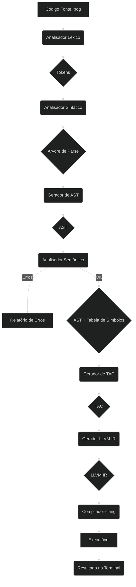

# Compilador Poglin

Este repositório contém a implementação e estudo de um compilador para a linguagem de programação **Poglin**(Baseada em Kotlin), desenvolvido como projeto da disciplina de **Compiladores** (2025-1, Prof. Dr. Ed Wilson Tavares Ferreira).

O compilador executa as seguintes fases:
- Análise léxica, sintática e semântica
- Geração de Árvore Sintática Abstrata (AST)
- Tradução para Código de Três Endereços (TAC)
- Tradução para LLVM IR usando `llvmlite`

---

## Linguagem Poglin: Especificação

### Tipos Primitivos
- `Int`: Inteiros (32 bits)
- `String`: Sequência de caracteres

### Palavras-Chave
- `start`, `end`, `var`, `if`, `else`, `while`, `println`, `readLine`, `pog`, `Int`, `String`

### Operadores
- Aritméticos: `+`, `-`, `*`, `/` (e `+` também concatena `String`)
- Lógicos: `&&`, `||`, `!`
- Relacionais: `==`, `!=`, `<`, `<=`, `>`, `>=`

### Estruturas de Controle
```poglin
if (cond) { bloco } else { bloco }

while (cond) { bloco }
```

---

## Fluxograma das Fases do Compilador (Mermaid)



---

## Arquitetura de Pastas

```bash
compiler_poglin/
├── grammars/                 # Gramática ANTLR (.g4)
│   └── .antlr/              # Cache ANTLR gerado
├── output/                  # Saída (.png, .tac, .ll)
├── src/
│   ├── ast/                 # Geração e visualização da AST
│   │   └── __pycache__/
│   ├── final_code/          # Geração de código LLVM
│   │   └── __pycache__/
│   ├── intermediario/       # Geração do código TAC
│   │   └── __pycache__/
│   ├── lexer/               # Lexer ANTLR e wrapper
│   │   └── __pycache__/
│   ├── parser/              # Parser ANTLR e wrapper
│   │   ├── generated/       # Arquivos ANTLR gerados
│   │   └── __pycache__/
│   ├── semantic/            # Analisador semântico e símbolos
│   │   └── __pycache__/
│   └── __pycache__/
├── tests/                   # Testes da linguagem (.pog)
├── main.py                  # Ponto de entrada do compilador
```

---

## Fases do Compilador

### Léxico (`src/lexer/`)
- `poglinLexer.py`: Gerado pelo ANTLR para tokenização
- `poglin_lexer.py`: Wrapper com tratamento de erros e formatação

### Sintático (`src/parser/`)
- `poglinParser.py`: Parser gerado pelo ANTLR
- `poglin_parser.py`: Wrapper customizado com validação sintática

### AST (`src/ast/`)
- `ast_generator.py`: Percorre a árvore de parse e gera a AST com Graphviz

### Semântico (`src/semantic/`)
- `symbol_table.py`: Tabela de símbolos com escopos e tipos
- `semantic_analyzer.py`: Validações semânticas (declarações, tipos, uso)

### Código Intermediário (`src/intermediario/`)
- `tac_classes.py`: Representações de operandos e instruções TAC
- `tac_generator.py`: Gera código intermediário linear (TAC)

### Código Final (`src/final_code/`)
- `llvm_generator.py`: Traduz TAC para LLVM IR usando `llvmlite`

---

## Como Usar o Compilador

### 1. Requisitos

- Python 3.8+
- Java (JRE) para executar o ANTLR
- Clang (para compilar LLVM IR em executável)
- Graphviz (software + lib Python)

### 2. Instalação de dependências

```bash
pip install antlr4-python3-runtime==4.11.1 llvmlite graphviz
```

> Obs: Certifique-se de que o executável `dot` do Graphviz está no PATH do sistema.

### 3. Gerar os arquivos ANTLR

Certifique-se que o `antlr-4.11.1-complete.jar` foi renomeado para `antlr.jar` e está na raiz do projeto.

```bash
java -jar antlr.jar -Dlanguage=Python -o src/parser/generated grammars/poglin.g4 -visitor -no-listener
```

---

## Executando o Compilador

```bash
python main.py <caminho_para_arquivo.pog> [--ast] [--tac] [--llvm]
```

### Opções:
- `--ast`: Gera e salva a AST em `.png`
- `--tac`: Imprime e salva o código de três endereços `.tac`
- `--llvm`: Imprime e salva o LLVM IR `.ll`

### Exemplo:

```bash
python main.py tests/classify_triangle.pog --ast --tac --llvm
```

---

## Compilando e Executando o LLVM IR

Após gerar um `.ll`, compile e execute assim:

```bash
clang output/classify_triangle.ll -o output/classify_triangle -lm
./output/classify_triangle
```

> Use `-lm` apenas se estiver usando funções matemáticas.

---

## Testes Incluídos

A pasta `tests/` contém exemplos de programas Poglin:

- `classify_triangle.pog`: Classificação de triângulos
- `pascal_triangle.pog`: Geração de triângulo de Pascal
- `sum_numbers.pog`: Entrada e concatenação de strings
- `divide_by_zero.pog`: Testa erro semântico de divisão por zero

---
